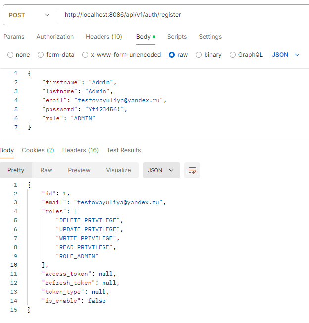
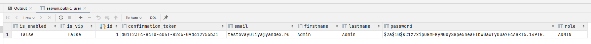
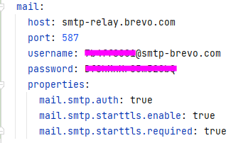
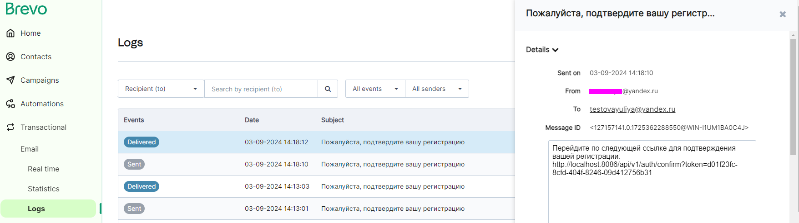
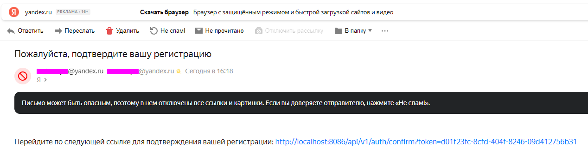
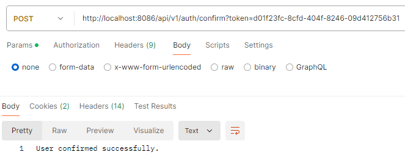
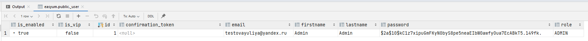

## Домашнее задание. Spring Boot Security

Необходимо разработать систему управления бронированием встреч в офисе.
В системе должны быть реализованы следующие функции:
- Регистрация и вход пользователей с подтверждением через почту.
- Роли пользователей: Администратор, Пользователь.
- Разные уровни доступа в зависимости от роли:
  - Администратор может управлять всеми бронированиями, пользователями, а также добавлять и редактировать комнаты для встреч.
  - Пользователь может просматривать доступные комнаты, создавать и отменять бронирования, видеть свои бронирования, будут vip комнаты, для vip пользователей.

Шаблон домашнего задания: https://github.com/MossaabFrifita/spring-boot-3-security-6-jwt

## Технологический стек

- к основному стеку проекта добавлен Spring Boot Starter Mail для отправки email

## Созданные сущности

В проекте были созданы следующие сущности:

- **User**
  - ID: уникальный идентификатор пользователя
  - firstname: имя пользователя
  - lastname: фамилия пользователя
  - email: адрес электронной почты
  - password: пароль (шифруется)
  - isVip: флаг, указывающий, является ли пользователь VIP
  - confirmationToken: токен подтверждения регистрации
  - isEnabled: флаг, указывающий, активирован ли аккаунт
  - role: роль пользователя (например, USER, ADMIN)

- **Room**
  - ID: уникальный идентификатор комнаты
  - name: название комнаты
  - isVip: флаг, указывающий, является ли комната VIP
  - isBooking: флаг, указывающий, забронирована ли комната

- **Booking**
  - ID: уникальный идентификатор бронирования
  - user: связь с пользователем, который сделал бронирование
  - room: связь с забронированной комнатой
  - isVipRoom(): метод для определения, является ли комната VIP

## Сервисы

- **UserServiceImpl** - Реализует логику управления пользователями.
- **RoomServiceImpl** - Реализует логику управления комнатами.
- **BookingServiceImpl** - Реализует логику управления бронированиями.
- **AuthenticationServiceImpl** - Реализует логику аутентификации и регистрации пользователей. Добавлено:
  - **sendConfirmationEmail(String email, String token)**: Отправляет письмо пользователю с ссылкой для подтверждения регистрации.
  - **confirmUser(String token)**: Подтверждает регистрацию пользователя по токену. Активирует аккаунт, если токен действителен.

### Подробнее про регистрацию пользователя с подтверждением через email
Шаги:
1. Отправка запроса на регистрацию:

 

2. В БД записывается новый пользователь с параметрами из запроса

На текущий момент пользователь неактивный (is_enabled=false) + сгенерирован токен на подтверждение регистрации по email

3. Отправлено письмо со ссылкой на подтверждение. Использовала сервис Brevo (ранее Sendinblue).
- настройки

- админка Brevo

- письмо

  
4. Переход по ссылке, пользователь успешно подтвержден:

5. Обновление информации о пользователе в БД: (is_enabled=true) + поле для токен очищено

## Контроллеры

Реализованы следующие контроллеры:

- **AuthenticationController**. Добавлено:
  - **confirmRegistration(String token)**: Подтверждает регистрацию пользователя по токену, возвращая результат операции.

- **UserController**
  - **getAllUsers()**: Возвращает список всех пользователей в системе. Доступно только для администраторов.
  - **createUser(User user)**: Создает нового пользователя. Доступно только для администраторов.
  - **updateUser(Long id, User userDetails)**: Обновляет информацию о существующем пользователе по указанному ID. Доступно только для администраторов.
  - **deleteUser(Long id)**: Удаляет пользователя по указанному ID. Доступно только для администраторов. 

- **RoomController**
  - **getAllRooms()**: Возвращает список всех комнат, если пользователь VIP или администратор, иначе возвращает список не-VIP комнат. Доступно для аутентифицированных пользователей (ADMIN, USER).
  - **createRoom(Room room)**: Создает новую комнату. Доступно только для администраторов.
  - **updateRoom(Long id, Room roomDetails)**: Обновляет информацию о существующей комнате по указанному ID. Доступно только для администраторов. 
  - **deleteRoom(Long id)**: Удаляет комнату по указанному ID. Доступно только для администраторов. 

- **BookingController**
  - **createBooking(Long roomId)**: Создает новое бронирование для указанной комнаты, для этого требуется, чтобы пользователь был аутентифицирован (имел роль 'ADMIN' или 'USER'). 
  - **getUserBookings(Long userId)**: Возвращает список всех бронирований для указанного пользователя, запрашиваемого по его ID. Доступно только аутентифицированным пользователям.
  - **updateBooking(Long id, Booking bookingDetails)**: Обновляет информацию о существующем бронировании по указанному ID. 
  - **deleteBooking(Long id)**: Удаляет бронирование по указанному ID, проверяя, является ли текущий пользователь VIP или администратором, если бронирование VIP. 

## Запуск проекта

- Build the project: `mvn clean install`
- Run the project: `mvn spring-boot:run`
